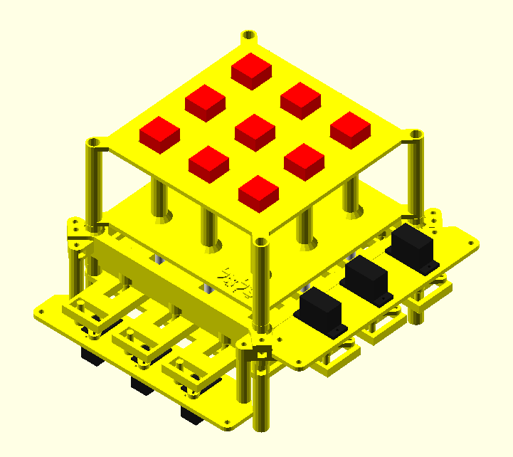

# Bezalel - An open-source 3D printable low-cost tactile display

Tactile interaction is considered the next frontier for human-computer interaction. A generic way to promote such interaction is by using a matrix of vertical pins that can render tactile shapes. Good examples of such matrices can be seen in the products developed by companies such as [metec Ag](https://www.metec-ag.de/produkte-graphik-display.php?p=t2d) and [Orbit Research](http://www.orbitresearch.com/product/graphiti/). An interesting discussion about the relevance of such devices can be found in the description of the [European Union Tactile Display Horizon Prize](https://research-and-innovation.ec.europa.eu/funding/funding-opportunities/prizes/horizon-prizes/tactile-display_en). 

Unfortunately, the manufacturing costs behind such matrices are typically very high because - among other reasons - each tactile "pixel" tends to require one actuator, and the number of actuators tends to grow quadratically with the resolution of the device. Also it is hard for traditional manufacturing processes to lower the cost of such devices on small scale. The goal of this project is to contribute to the creation of a generation of tactile displays that rely on 3D printing technologies so that they can be manufactured at home at a low cost. We provide a novel mechanical design and an algorithm with which people can create tactile devices that use a small number of actuators and that can be manufactured with 3D printed parts.



## 3x3 matrix
I currently have a functional 3x3 device that implements the proposed technology, as seen in this [youtube video](https://www.youtube.com/watch?v=CwHi78mkTRg). I am rewriting the Arduino firmware before publishing it in this repository, but a didactic version of the algorithm used to control the actuators is available in the directory where the 3x3 matrix OpenSCAD files are located. The OpenSCAD model has been created with the goal of clearly conveying all the concepts behind the mechanical model and the algorithm, but please feel free to contact me if you need any further clarification.

## Roadmap


The ultimate aim of this project is to develop tactile matrices that can be used to convey not only braille characters, but also tactile graphics. Ideally, the spacing between the braille dots would be close to 2.5mm, the typical size used in similar technologies. However, building grids as small as 2.5mm is a very ambitious goal.

Fortunately, there are many exciting applications for matrices with grids that are larger than 2.5mm. For example, companies such as Lego® have already released braille blocks that can be used to educate blind children. We envision that our technology could be used to create digital tables where the dots are similarly big, for educational purposes, while we continue to work towards smaller grids.

We are confident that advancements in 3D printing technologies will make it increasingly feasible to achieve our goal over the next decade. In the meantime, we will keep publishing grids that increase the number of dots and decrease the size of the dots, as people adapt our designs for various applications. 

## 2022
- [x] Publish the proof of concept 3D printable mechanical design of a 3x3 matrix

## 2023
- [ ] Publish the mechanical model and firmware of an 8x8 matrix

## 2024
- [ ] Publish the mechanical model and firmware of a 16x16 matrix
- [ ] Publish suggestions about potential usage of the Bezalel technology to teach programming to blind kids

## Motivation
I started working with computers at a very young age, and children often have interesting dreams. One of my childhood dreams was to create a technology that would allow people to interact with computers without using their eyes. This is something that I had never focused on, but during her second pregnancy, my wife was misdiagnosed with an infection that could cause our daughter to be born blind. It took one week for us to realize it was a misdiagnosis, but this experience led me to decide to revisit this idea. This repository contains the results of my efforts towards the goal of creating a low-cost tactile interface that can be used regardless of whether we have sight or not. There is a long road ahead, but I hope to leave a legacy towards this goal by sharing what I have achieved so far.

### Fun fact
The development of the prototype that I am sharing involved a lot of manual work and trial and error. During this process, I have constantly asked God to give me the skills necessary to achieve my goal, such as assembling, maintaining, and using a 3D printer, designing mechanical parts, etc. I honestly believe that he answered my request for help, and that is why I decided to name the project Bezalel. According to the Bible, Bezalel was a man who received craftsmanship skills from God.

## Legal notice
### Licence
- The mechanical design (3d-printable-device-2022) is free; you can redistribute it and/or modify it under the terms of the GNU General Public Licence version 3 as published by the Free Software Foundation.
- The simulator (siggraph-asia-2019) is also free, and you can distribute it and/or modify it under the terms of the GNU Affero General Public License v3.0 as published by the Free Software Foundation.

### Patent
A patent was filed in 2019 following the defensive publication approach. Both the patent and the detailed publication of the Bezalel solution have the basic goal of sharing the project while also preventing the progress of this invention from being hindered by someone with legal rights over the invention.
We are following the defensive patent approach used by the RepRap project: https://reprap.org/wiki/RepRapGPLLicence

### Trademarks
LEGO® is a trademark of the LEGO Group of companies which does not sponsor, authorize or endorse this site

## How to contribute

### Build, share, adapt
If you like this project, feel free to replicate and to improve it.

### Don't forget to cite us
A seminal paper about Bezalel has been published in SIGGRAPH ASIA 2019.
If you are using Bezalel for academic purposes, please remember citing the paper:

```
Pedro de Almeida Sacramento, Ricardo dos Santos Ferreira, and Marcus Vinicius Alvim Andrade. 2019. Bezalel - Towards low-cost pin-based shape displays. In SIGGRAPH Asia 2019 Technical Briefs (SA ’19 Technical Briefs), November 17–20, 2019, Brisbane, QLD, Australia. ACM, New York, NY, USA, Article 4, 4 pages. https://doi.org/10.1145/3355088.3365144
```
