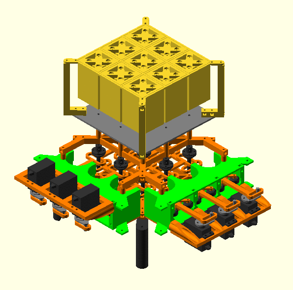

# Bezalel - An open-source 3D printable low-cost tactile display

Tactile interaction is considered the next frontier for human-computer interaction.
A generic approach to provide such an interaction is the creation of a matrix of vertical pins that move up and down so that tactile shapes can be rendered.
Unfortunatelly, the manufacturing costs for building such matrices is typically very high, basically because each tactile "pixel" needs an actuator, and the number of actuators grow quadratically with the resolution of the device.
The goal of this project is to contribute to the creation of a generation of tactile displays that can be manufactured at home with a low-cost.
We provide a novel mechanical design and an algorithm with which tactile devices can be manufactured at home with 3D printed parts and a small amount of actuators.



## Roadmap
- [x] Share the tactile interface 3D printable mechanical design
- [ ] Share the tactile interface firmware
- [ ] Share an application that can be used to teach computer programaming to kids using the tactile interface

## Motivation
I started working with computers when I was very young, and kids typically have interesting dreams.
One of my childhood dreams was to create a technology that would allow people to interact with computers without using their eyes.
I have three eyesighted kids, and when the second one was still in the womb, my wife was misdiagnosed with an infection that could make my daughter to be born blind.
During one week (the time necessary for us to figure out that it was a misdiagnosis) I've been thinking about what kind of technology we would need for our daughter to have autonomy in many daily activities.
This experience led me to stop waiting for an opportunity, and immediatly focus on trying to create the technology I've been always dreaming about.
This repository contains the results of my efforts towards the goal of making a low-cost tactile interface that can be used regardless we are eyesighted or not.
There's a long road ahead, but I hope to leave a legacy towards this goal by sharing what I've got so far.

### Fun fact
The name of the project is Bezalel because the Bible describes an artisan called Bezalel who received craftsman skills from God.
The development of the proposed technology involved trial and error, and an insane amount of manual work.
During this process I've been constantly asking God to give me the craftsman skills necessary to accomplish my goal.

## Legal notice
### Licence
- The mechanical design (3d-printable-device-2022) is free; you can redistribute it and/or modify it under the terms of the GNU General Public Licence version 3 as published by the Free Software Foundation.
- The simulator (siggraph-asia-2019) is also free, and you can distribute it and/or modify it under the terms of the GNU Affero General Public License v3.0 as published by the Free Software Foundation.

### Patent
A patent was filled in 2019 following the defensive publication approach. Both the patent and the detailed publication of Bezalel solution have the basic goal of sharing the project while also avoiding that the progress of this invention is hindered by someone with legal rights over the invention.
We are following the defensive patent approach used by the RepRap project: https://reprap.org/wiki/RepRapGPLLicence

## How to contribute

### Build, share, adapt
If you like this project, feel free to replicate and to improve it.

### Don't forget to cite us
When using Bezalel for academic purposes, please remember citing our seminal SIGGRAPH ASIA 2019 paper:

```Pedro de Almeida Sacramento, Ricardo dos Santos Ferreira, and Marcus Vinicius Alvim Andrade. 2019. Bezalel - Towards low-cost pin-based shape displays. In SIGGRAPH Asia 2019 Technical Briefs (SA ’19 Technical Briefs), November 17–20, 2019, Brisbane, QLD, Australia. ACM, New York, NY, USA, Article 4, 4 pages. https://doi.org/10.1145/3355088.3365144```
