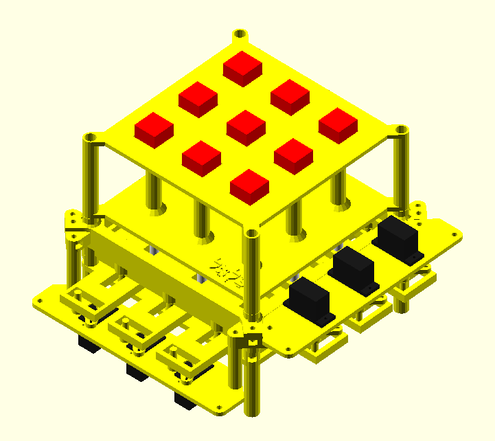

# Bezalel — Open-source, 3D-printable, low-cost tactile display


**Bezalel** is an open-source technology for building **tactile interfaces** using **3D printing** and **a minimal number of actuators**.  
It enables makers, researchers, and educators to prototype **shape-changing displays** that are affordable and easy to build.

## 🚀 Key Features
- **Low-cost & efficient:** Control many pins with few actuators  
- **Fully open-source:** All mechanical designs are 3D printable  
- **Modular & educational:** Ideal for research, accessibility, and learning projects

## 🧩 How it works
Bezalel introduces a **novel actuation principle** where a small set of actuators controls an entire grid of pins.

Two orthogonal groups of actuators push or pull an array of rotary elements, efficiently converting their motion into independent pin actuation.

This enables:
- High refresh speed  
- Minimal actuator count (scales linearly, not quadratically)  
- FDM friendly 3D printable mechanical assemblies

👉 Learn more in this [YouTube explanation](https://www.youtube.com/watch?v=fyhcJz_-Ox4).


## 🧠 The 3D-printable prototype
We provide a **3×3 matrix prototype** implementing the Bezalel principle.

This model demonstrates how a low number of actuators can control a tactile pin array.



- Controlled via **GRBL 1.1h firmware**  
- [Latest iteration video](https://www.youtube.com/shorts/zZdskc9G0Oo)

## 💡 Why tactile displays matter
Tactile interaction is a key frontier in **human-computer interaction**, particularly for **assistive technologies** for the blind and visually impaired.

Traditional tactile displays are expensive because each pin usually needs its own actuator — making cost grow **quadratically** with resolution.

Bezalel breaks this limitation, offering a **low-cost, maker-friendly** alternative.

📘 See the [EU Horizon Tactile Display Prize](https://digital-strategy.ec.europa.eu/en/news/european-commission-announces-eu3-million-horizon-prize-develop-tactile-display-visually-impaired) for context on the importance of such technologies.

## 🛠️ Roadmap

### 2026
- ⏲️ Started exploring Bezalel for **human-AI interaction**

### 2025
- ⏲️ Started an **inclusive tactile educational game**, using Bezalel technology, for both blind and sighted children (📹 [Video (in progress)](https://www.youtube.com/shorts/zZdskc9G0Oo) | 🎮 [Web Simulator](https://pedrosacramento.github.io/tictactoe/))

### Past milestones
#### 2024
- 🥈 Runner-up — *Visual Impairments* category, [Build2gether 2.0 (Hackster.io / ETH Zurich)](https://www.hackster.io/pedrosacramento/bezalel-open-source-3d-printable-tactile-display-5aa8e6) (📹 [Video](https://www.youtube.com/shorts/BmYJGurla8U))
#### 2023
- 🏅 Featured among [Top 100 Create The Future Design Contest submissions](https://contest.techbriefs.com/2023/top-100) (📹 [Video](https://www.youtube.com/watch?v=p8M2p39o1eg))
#### 2022
- 🧱 Published the **first 3D-printable 3×3 proof of concept** (📹 [Video (only pins)](https://www.youtube.com/watch?v=CwHi78mkTRg))

## 🌍 Long-term vision
We expect this technology to serve as the foundation for a new generation of 3D-printable interfaces that do not rely on vision or hearing.  

Among the products we envision are educational devices for teaching programming and music, as well as tactile games.

## ❤️ Motivation
When my wife was pregnant with our second child, she was misdiagnosed with an infection that could cause blindness in our daughter.

Thankfully, it was a false alarm - but it deeply moved me to revisit an old idea: building **tactile interfaces** to empower blind individuals.

This project reflects a personal pursuit that bridges faith and craftsmanship. It is named Bezalel, after the biblical figure who expressed his technical and artistic skills as a form of worship to God.

## ⚖️ Legal notice

### License
- **STL files**: Creative Commons Attribution 4.0 International (CC BY 4.0)
- **Code**: Apache 2.0

© Pedro Sacramento

### Patent
Bezalel's mechanical design is covered by Brazilian patent BR 102019021008 (filed 2019, granted May 2026).

Open-source hardware and patent rights can coexist. The STL files and code remain freely available under their respective licenses, but the patent governs how the mechanism may be used in Brazil:

- **Research and personal use** — free
- **Commercial use in Brazil** — requires a license

For commercial licensing inquiries, contact Pedro Sacramento.

## 🤝 How to contribute

### Build • Share • Adapt
You’re encouraged to 3D print, modify, and expand Bezalel for your own projects.  
Please share your results so others can learn from them too.

### Cite our work
If you use Bezalel in academic research, please cite our SIGGRAPH Asia paper:
```
Pedro de Almeida Sacramento, Ricardo dos Santos Ferreira, and Marcus Vinicius Alvim Andrade. 2019. Bezalel - Towards low-cost pin-based shape displays. In SIGGRAPH Asia 2019 Technical Briefs (SA ’19 Technical Briefs), November 17–20, 2019, Brisbane, QLD, Australia. ACM, New York, NY, USA, Article 4, 4 pages. https://doi.org/10.1145/3355088.3365144
```

## 🔗 Links
- [YouTube: Mechanism overview](https://www.youtube.com/watch?v=fyhcJz_-Ox4)  
- [Hackster.io project page](https://www.hackster.io/pedrosacramento/bezalel-open-source-3d-printable-tactile-display-5aa8e6)  
- [SIGGRAPH Asia 2019 Paper](https://doi.org/10.1145/3355088.3365144)
